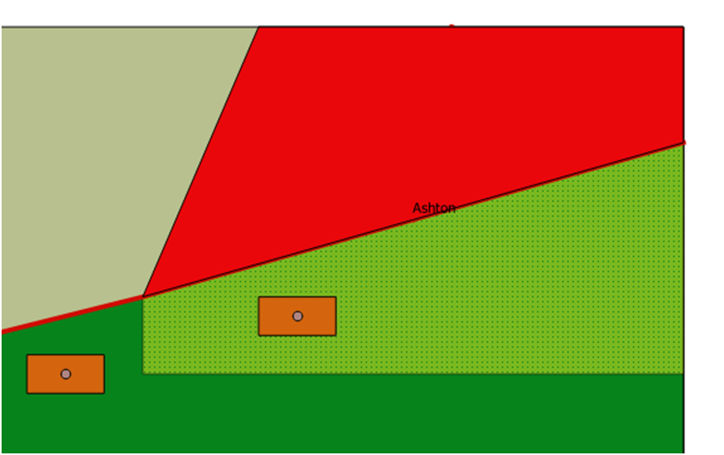
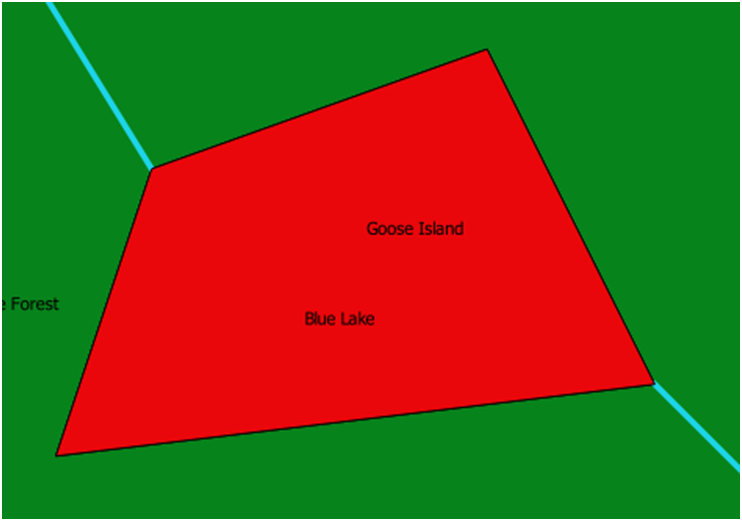

# 1. Utworzenie bazy danych przestrzennych w programie Spatialite_Gui, dodanie tabel oraz umieszczenie w nich obiektów
[TworzenieBazyPrzestrzennej_CreatingSpatialDatabase]

Utworzona baza danych, zaimportowana i wyświetlona w programie QGIS:

# 2. Zapytania wykonane na bazie danych w programie QGIS [Zapytania_Queries]. Przykładowe wyniki zapytań, których rezultatem wykonania są selekcje geometryczne (czerwony kolor)

12\. Granica "Goose Island" \
 \
13\. Minimalny prostokąt ograniczający "Goose Island" \
 \
21\. Centroid "Goose Island" \
 \
24\. Zewnętrzna granica "Blue Lake" \
 \
28\. Drugi element geometryczny drogi nr 75 \
 \
31\. Centroid stawów \
 \
32\. Punkt na stawie \
 \
44\. Różnica "Ashton" minus "Green Forest" \
 \
45\. Suma "Blue Lake" i "Goose Island" \
 \
47\. Bufor 15m wokół "Cam Bridge" \

[TworzenieBazyPrzestrzennej_CreatingSpatialDatabase]:TworzenieBazyPrzestrzennej_CreatingSpatialDatabase.sql
[Zapytania_Queries]:Zapytania_Queries.sql